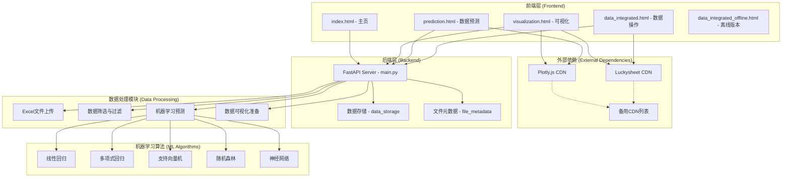
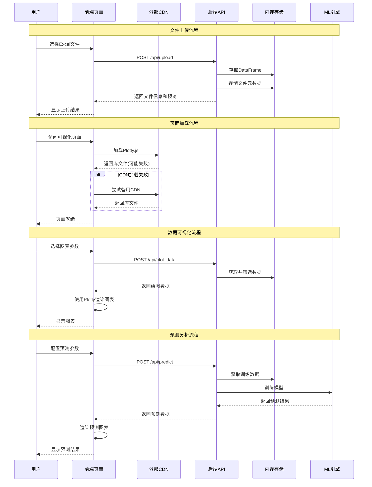
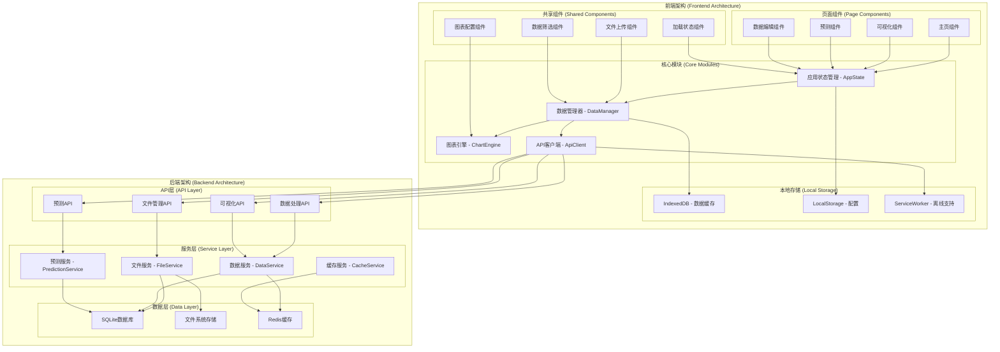
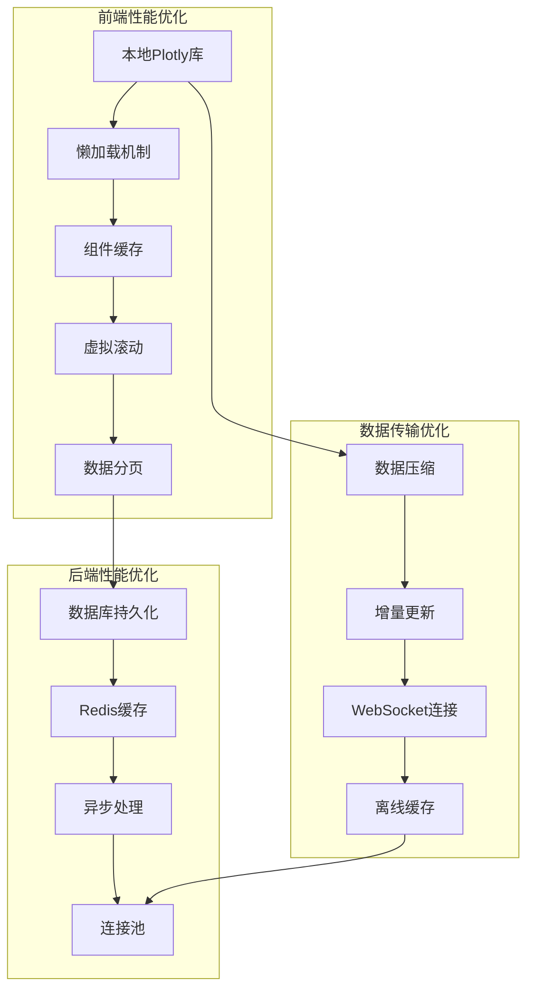

# DaPlot 项目架构分析与优化方案

## 当前架构概览

### 系统架构图

### 数据流图

## 当前问题分析

### 1. Plotly加载慢的问题

**问题根因：**
- 依赖外部CDN，网络延迟和可用性问题
- 每个页面都重新加载Plotly库
- 缺乏本地缓存机制
- 备用CDN机制虽然存在但切换时间长

**影响：**
- 页面切换等待时间长
- 用户体验差
- 在网络不稳定环境下无法使用

### 2. 文件数据传输问题

**问题根因：**
- 数据存储在后端内存中，页面刷新后丢失
- 缺乏持久化存储机制
- 文件ID在页面间传递不稳定
- 大文件传输效率低

**影响：**
- 数据容易丢失
- 页面间数据共享困难
- 系统重启后所有数据丢失

### 3. 架构扩展性问题

**问题根因：**
- 前端页面间缺乏统一的状态管理
- 后端API设计分散，缺乏模块化
- 没有统一的数据管理层
- 缺乏组件化设计

## 优化方案设计

### 方案一：模块化架构重构

### 方案二：性能优化策略

## 具体实施计划

### 阶段一：基础设施优化 (1-2周)

1. **Plotly本地化**
   - 下载Plotly.js到本地
   - 实现本地fallback机制
   - 添加版本管理

2. **数据持久化**
   - 集成SQLite数据库
   - 实现文件存储服务
   - 添加数据备份机制

3. **API重构**
   - 模块化API设计
   - 统一错误处理
   - 添加API文档

### 阶段二：前端架构重构 (2-3周)

1. **状态管理系统**
   - 实现全局状态管理
   - 添加数据缓存层
   - 实现页面间数据共享

2. **组件化改造**
   - 提取共享组件
   - 实现组件懒加载
   - 添加组件测试

3. **性能优化**
   - 实现虚拟滚动
   - 添加数据分页
   - 优化渲染性能

### 阶段三：功能扩展 (1-2周)

1. **离线支持**
   - 实现ServiceWorker
   - 添加离线数据缓存
   - 实现离线模式切换

2. **高级功能**
   - 实时数据更新
   - 协作编辑功能
   - 数据导入导出优化

## 技术选型建议

### 前端技术栈
- **状态管理**: Zustand 或 Redux Toolkit
- **数据缓存**: IndexedDB + Dexie.js
- **图表库**: 本地Plotly.js + Chart.js备选
- **构建工具**: Vite + TypeScript
- **UI框架**: 保持原生HTML/CSS，逐步引入组件化

### 后端技术栈
- **数据库**: SQLite (开发) + PostgreSQL (生产)
- **缓存**: Redis
- **任务队列**: Celery + Redis
- **文件存储**: 本地文件系统 + MinIO (可选)
- **API文档**: FastAPI自动生成 + Swagger UI

### 部署和运维
- **容器化**: Docker + Docker Compose
- **反向代理**: Nginx
- **监控**: Prometheus + Grafana
- **日志**: ELK Stack (可选)

## 预期收益

1. **性能提升**
   - 页面加载时间减少60-80%
   - 数据传输效率提升50%
   - 图表渲染速度提升30%

2. **用户体验改善**
   - 消除页面切换等待
   - 数据不再丢失
   - 支持离线使用

3. **开发效率提升**
   - 模块化开发
   - 代码复用率提高
   - 维护成本降低

4. **系统稳定性**
   - 减少外部依赖
   - 数据持久化保障
   - 错误处理完善

## 风险评估与应对

### 技术风险
- **风险**: 架构重构可能引入新bug
- **应对**: 分阶段实施，保持向后兼容

### 时间风险
- **风险**: 重构时间可能超预期
- **应对**: 优先实施核心功能，非核心功能可后续迭代

### 兼容性风险
- **风险**: 新架构可能与现有数据不兼容
- **应对**: 实现数据迁移工具，保证平滑过渡

---

*本文档将根据实施进展持续更新*